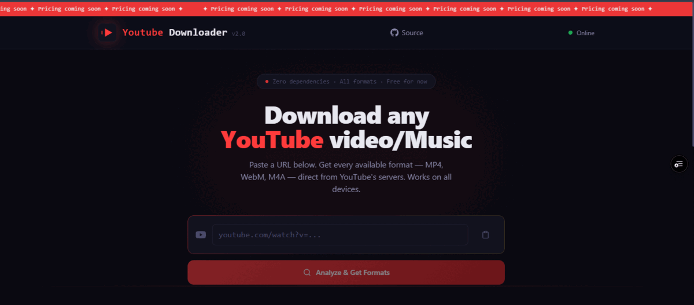
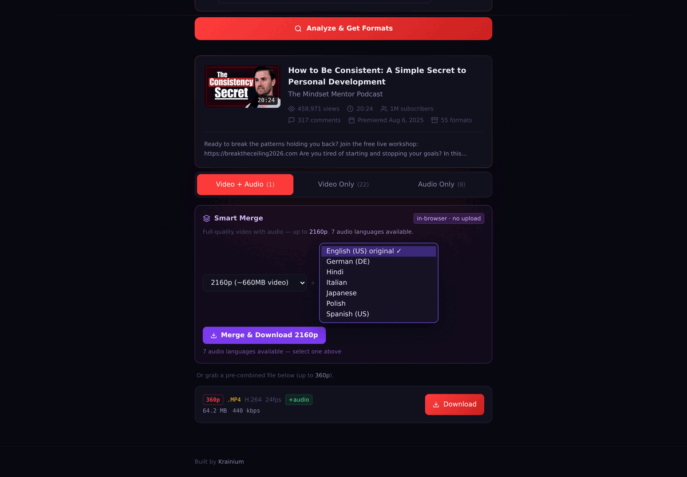
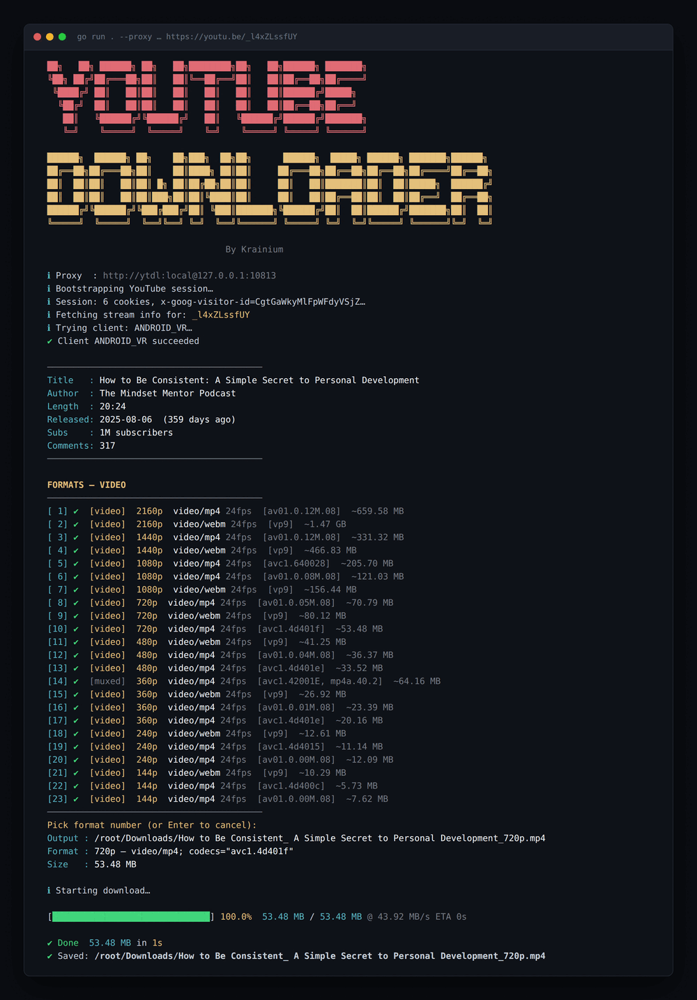

# YouTube Downloader

> Download any YouTube video or audio directly — CLI tool and full-featured web app.

Hits YouTube's internal Innertube API the same way the official apps do. Pulls every available format, resolution, and codec. Works on Linux, macOS, and Windows.

---

## Web App — [youtubeone.vercel.app](https://youtubeone.vercel.app)

A privacy-first YouTube downloader that runs entirely in your browser. No sign-in, no tracking, no file upload.





### Features

- **Smart Merge** — merges a high-quality video-only stream with audio using ffmpeg compiled to WebAssembly, completely in-browser. Supports up to 4K.
- **Dubbed language picker** — when a video has dubbed audio tracks (e.g. Hindi, Spanish, French…), Smart Merge shows a second dropdown so you can pick exactly which language to pair with the video. The original language is always pre-selected. No other public downloader exposes this.
- **All formats** — three tabs: Video + Audio (pre-muxed up to 360p), Video Only (up to 4K, no audio), Audio Only (original language, all bitrates).
- **No upload** — your video never leaves your device. ffmpeg runs locally via WebAssembly.
- **Fast** — ffmpeg stream-copies both tracks (no re-encode), so muxing a 1 GB 4K file takes a few seconds.

### How Smart Merge works

1. Paste a YouTube URL and hit Enter.
2. Open the **Video + Audio** tab — Smart Merge appears at the top.
3. Choose video quality from the first dropdown.
4. If the video has dubbed tracks, a **language dropdown** appears — choose the audio language.
5. Hit **Merge & Download**. ffmpeg loads (cached after first use), fetches both streams, muxes them in-browser, and saves `Title [1080p] [Hindi].mp4` to your downloads.

### Extraction routing

YouTube bot-blocks datacenter IPs, so the deployed app does not call YouTube from Vercel directly. Xray-core runs inside the same container as the Next.js server and exposes one local HTTP proxy port per VLESS node.

```
Vercel container
├── Xray-core      127.0.0.1:10809+i  →  VLESS/REALITY  →  exit IP i
└── Next.js        picks an exit per request
```

A request picks a random exit, retries on another if the first is refused, and the chosen node index travels with the response so `/api/stream` downloads through the same exit — YouTube signs CDN URLs against the requesting IP.

The node list reads at boot from the `VLESS_NODES` environment variable, one `vless://` URI per line. See `web/.env.example`.

| Variable | Purpose |
|---|---|
| `VLESS_NODES` | Node list, one URI per line (required) |
| `XRAY_BASE_PORT` | First local proxy port, default `10809` |
| `PROXY_TIMEOUT_MS` | Per-request tunnel timeout, default `20000` |
| `YTDL_DEBUG` | Set to `1` to log which exit and client answered |

Deployment is a container build (`web/Dockerfile.vercel`) rather than the default Next.js build, because Xray has to run alongside the server.

---

## CLI Tool

Download any YouTube video or audio directly from the terminal — no API key, no dependencies.



### Run it

```bash
# Linux / macOS
go run .

# Windows
build.bat

# Non-interactive (downloads best video)
go run . https://www.youtube.com/watch?v=VIDEO_ID
```

### Options

| Flag | Description |
|---|---|
| `-o <dir>` | Custom output directory |
| `--cookies <file>` | Netscape cookies.txt for private/age-gated videos |
| `--proxy <url>` | HTTP/SOCKS5 proxy URL |

### Build binaries

```bash
# Linux
CGO_ENABLED=0 go build -o ytdl .

# Windows (cross-compile from Linux/macOS)
GOOS=windows GOARCH=amd64 CGO_ENABLED=0 go build -o ytdl.exe .
```

> Go 1.22+ required. Zero external dependencies.
